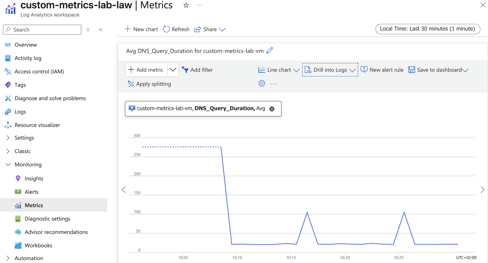

# Azure Custom Metrics Lab

A Terraform-based lab environment for learning Azure custom metrics by monitoring DNS query performance from a virtual machine.

## Overview

This project deploys an Ubuntu VM that automatically performs DNS queries every minute and sends custom metrics to Azure Monitor. The system tracks DNS query duration, success/failure rates, and other metrics with configurable dimensions like environment stage.

## Architecture

- **Azure VM**: Ubuntu 22.04 LTS with managed identity
- **DNS Monitoring**: Configurable Python or shell script with cron job (runs every minute)
- **Custom Metrics**: Sent to Azure Monitor with dimensions for stage, domain, VM name, and metric type
- **Log Analytics**: Workspace for centralized logging

## Prerequisites

- Azure CLI installed and authenticated
- Terraform installed
- SSH key pair generated (`~/.ssh/id_rsa.pub` by default)

## Usage

1. **Configure variables**:
   ```bash
   cd terraform
   cp terraform.tfvars.example terraform.tfvars
   # Edit terraform.tfvars with your values
   ```

2. **Deploy infrastructure**:
   ```bash
   terraform init
   terraform plan
   terraform apply
   ```

3. **Connect to VM**:
   ```bash
   # Use the SSH command from Terraform output
   ssh azureuser@<public-ip>
   ```

4. **Monitor metrics**:
   - Check logs: `tail -f /var/log/dns-monitor.log`
   - View cron logs: `tail -f /var/log/dns-monitor-cron.log`
   - Access Azure Monitor in the Azure portal

5. **Clean up**:
   ```bash
   terraform destroy
   ```

## Configuration

Key variables in `terraform.tfvars`:
- `stage`: Environment (dev/prelive/live)
- `target_domain`: Domain to monitor (default: example.com)
- `monitor_script_type`: Choose between "python" (default) or "shell" implementation
- `vm_size`: VM size (default: Standard_B2s)
- `location`: Azure region (default: West Europe)

## Custom Metrics

The system sends these metrics to Azure Monitor:
- **DNS_Query_Metrics**: Duration and success rate
- **Dimensions**: stage, domain, vm_name, metric_type

Metrics are extensible - modify the monitoring script in `cloud-init.yml` (Python) or `cloud-init-shell.yml` (shell) to add new monitoring capabilities.

### Script Implementation Options

- **Python** (`monitor_script_type = "python"`): Uses Python 3 with requests library
- **Shell** (`monitor_script_type = "shell"`): Pure bash script using curl, jq, dig, and bc



## Viewing Metrics with Azure CLI

You can query custom metrics using the Azure REST API via `az rest`:

**Get VM resource ID:**
```bash
VM_RESOURCE_ID=$(az vm show --resource-group <resource-group> --name <vm-name> --query id --output tsv)
```

**Query custom DNS metrics:**
```bash
# Set time range (last 4 hours)
START_TIME=$(date -u -v-4H +%Y-%m-%dT%H:%M:%SZ)
END_TIME=$(date -u +%Y-%m-%dT%H:%M:%SZ)

# Query both DNS metrics
az rest --method GET \
  --url "https://management.azure.com$VM_RESOURCE_ID/providers/microsoft.insights/metrics?api-version=2018-01-01&metricnames=DNS_Query_Duration,DNS_Query_Success&metricNamespace=Custom/DNS&timespan=$START_TIME/$END_TIME&interval=PT1M&aggregation=Average" \
  --output json
```

**Use the test script:**
```bash
# Run the provided test script for formatted output
./testcase/retrieve-custom-metrics.sh <resource-group> <vm-name>
```

Custom metrics use the namespace `Custom/DNS` and may take 5-15 minutes to appear in Azure Monitor after being sent.